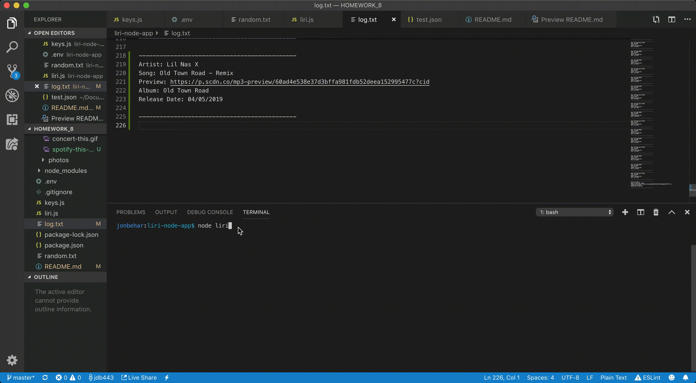
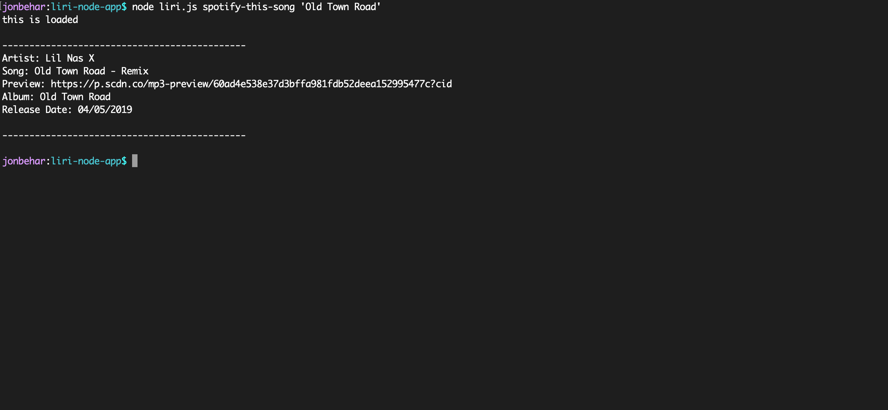

# liri-node-app
## Homework 8 Liri Bot
In this assignment, you will make LIRI. LIRI is like iPhone's SIRI. However, while SIRI is a Speech Interpretation and Recognition Interface, LIRI is a Language Interpretation and Recognition Interface. LIRI will be a command line node app that takes in parameters and gives you back data.

### Walk through

Note: This app is running npm version 6.9.2 on a Mac with node installed.

To get the app to work please download the following npm commands:

```js
npm -v
npm init -y
npm i dotenv
npm i moment
npm i liri-node-app
```

You will also need to create the following file

```
# .env contents format
# Spotify API keys

SPOTIFY_ID=123456789
SPOTIFY_SECRET=1234567890

# OMDBI API key
OMDBI_KEY=123456789

# bandsintown API key
BANDS_KEY=123456789
```

1. This can be done by going to the Spotify website and creating an account.
2. This can be done by going to the OMDBI website and setting up an account.
3. This can be done by going to the Bandsintown api and setting up an account.

You will also need to run command.
```js
node liri.js
```
---------------------------------------------------------------------------------------

### GIFs

1. `concert-this` - To run this command use `node liri.js concert-this '<Artist Name/Band Name>'`. <br/>
    example: `node liri.js concert-this 'Lady Gaga'`. <br/>
    

    <br/>
2. `spotify-this-song`- To run this command use `node liri.js spotify-this-song '<Song Name>'`. <br/>
    Example 1: `node liri.js spotify-this-song 'Old Town Road'`. <br/>
    

    <br/>
    Example 2: `node liri.js spotify-this-song` if no song is displayed. <br/>
    

    <br/>
3. `movie-this` - To run this command use `node liri.js movie-this '<Movie Name>'`. <br/>
    Example 1: `node liri.js movie-this 'Home Alone'`. <br/>
    

    <br/>
    Example 2: `node liri.js movie-this` if no movie is displayed. <br/>
    

    <br/>
4. `do-what-it-says` - To run this command use `node liri.js do-what-it-says`. <br/>
    

    <br/>
    <br/>
---------------------------------------------------------------------------------------

### Screenshots
1. `concert-this` - To run this command use `node liri.js concert-this '<Artist Name/Band Name>'`. <br/>
    example: `node liri.js concert-this 'Lady Gaga'`. <br/>
    

    <br/>
2. `spotify-this-song`- To run this command use `node liri.js spotify-this-song '<Song Name>'`. <br/>
    Example 1: `node liri.js spotify-this-song 'Old Town Road'`. <br/>
    

    <br/>
    Example 2: `node liri.js spotify-this-song` if no song is displayed. <br/>
    

    <br/>
3. `movie-this` - To run this command use `node liri.js movie-this '<Movie Name>'`. <br/>
    Example 1: `node liri.js movie-this 'Home Alone'`. <br/>
    

    <br/>
    Example 2: `node liri.js movie-this` if no movie is displayed. <br/>
    

    <br/>
4. `do-what-it-says` - To run this command use `node liri.js do-what-it-says`. <br/>
    

    <br/>

---------------------------------------------------------------------------------------

### Bug fix

During the log.txt stage after running the terminal commands I noticed when viewing preview my Spotify api was show so I removed it using:
```js
.split("=")[0]
```
to preview your spotify songs paste the url after the preview and add
```
=SPOTIFY_ID
```
Note: the ` SPOTIFY_ID ` should not be in quotes and should be written as  ` =123456789 ` and not `=SPOTIFY_ID123456789`

---------------------------------------------------------------------------------------

### This application uses

* node.js
* moment.js
* Spotify API
* Bands in Town API
* OMDB API
